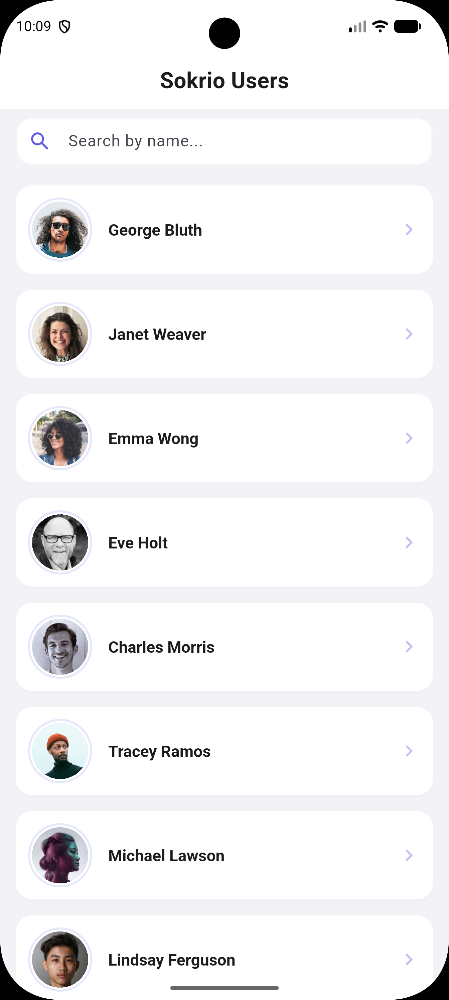
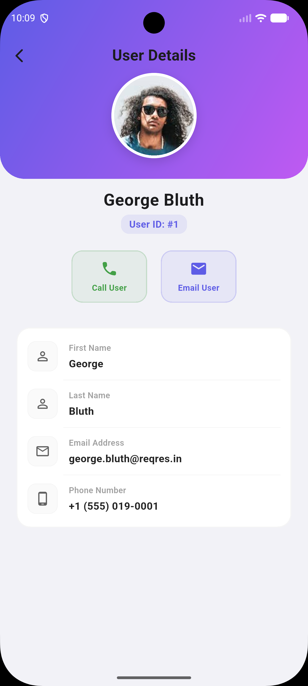

# Sokrio User App

A clean, responsive Flutter mobile application that fetches and displays user profiles from a public API, implementing paginated infinite scrolling, local offline caching, and real-time search filtering.

Built using **Clean Architecture** principles and production-ready design practices.

### 📥 Direct Download
👉 [**Download APK v1.0.0**](https://github.com/Zaminur151/sokrio-user-app/releases/download/v1.0.0/app-release.apk)

---

## 📸 App Screenshots

<p align="center">
  
  &nbsp;&nbsp;&nbsp;&nbsp;&nbsp;&nbsp;&nbsp;&nbsp;
  
</p>

---

## 📱 Features

- **User List Screen**: Fetches and renders a clean listing of users with names and profile pictures.
- **User Detail Screen**: Shows a detailed card profile of the selected user with high-res avatars, contact metrics, and quick action shortcuts (Email/Call).
- **Infinite Scroll Pagination**: Automatically fetches batches of 10 users as you scroll near the bottom and halts gracefully when the maximum pages are loaded.
- **Local Search Filtering**: Performs case-insensitive matching by name or email. Works seamlessly both online and offline.
- **Offline Caching**: Caches loaded users locally, enabling instant launches and fallback search utility even when network is unavailable.
- **Micro-Animations**: Smooth hero image transitions and subtle card hover gestures for a premium UI experience.

---

## 🛠️ Technical Stack

- **Architecture**: Clean Architecture (Clear segregation of Core, Domain, Data, and Presentation layers).
- **State Management**: [Provider](https://pub.dev/packages/provider) for clean, reactive widgets.
- **Dependency Injection**: [GetIt](https://pub.dev/packages/get_it) container registering and binding resources globally.
- **Networking**: [Dio](https://pub.dev/packages/dio) client with 10s timeout configurations and [PrettyDioLogger](https://pub.dev/packages/pretty_dio_logger) request/response log prints.
- **API Header Authentication**: Attached custom `x-api-key: free_user_3FdkgBKPLlZVRRyBrRPbq5k0JjM` request header globally.
- **Local Cache Database**: [SharedPreferences](https://pub.dev/packages/shared_preferences) for serialization persistence.
- **Network Connectivity**: [ConnectivityPlus](https://pub.dev/packages/connectivity_plus) for active offline checks.

---

## 🏗️ Architecture Design

The project is structured according to **Clean Architecture** directories:

```
lib/
├── core/                  # Shared configurations and utilities
│   ├── di/                # Dependency injection setup
│   ├── errors/            # Custom Failure entities and functional Result wrappers
│   ├── network/           # Device internet connectivity monitors
│   └── theme/             # Global premium colors, font weights, and shape tokens
│
├── domain/                # pure business rules and entity specifications
│   ├── entities/          # Core model structural definitions
│   ├── repositories/      # Core repository interfaces/contracts
│   └── usecases/          # Execution logic operations (e.g. GetUsers)
│
├── data/                  # Implementations of repository contracts
│   ├── datasources/       # Data providers (Dio API Remote, SharedPreferences Local)
│   ├── models/            # JSON serialization mappings
│   └── repositories/      # Coordinate repositories handling network-check cache loops
│
└── presentation/          # User interface elements and state providers
    ├── providers/         # State controllers managing list loads, scroll updates, and filters
    ├── pages/             # View widgets (UsersView list screen and UserDetailsView)
    └── widgets/           # Sub-widgets (UserListCard, BottomLoader, ListSkeleton, cards)
```

---

## 🧪 Testing

The project has robust unit and widget test coverage:
1. **Model Parsing**: Verification of JSON parsing mappings and fallback builders.
2. **API Mock Testing**: Tests network endpoints, mock request responses, and custom exception mappings without executing actual HTTP client queries.
3. **Widget Layout Layout**: Simple unit testing of standard layouts like custom tiles.

Run the test suite:
```bash
flutter test
```

Verify compile checks:
```bash
flutter analyze
```

---

## 🚀 Getting Started

### 📋 Prerequisites
- Flutter SDK (version `^3.11.5` or higher)

### 💻 Installation
1. Clone the repository and navigate to the project directory:
   ```bash
   cd sokrio_user
   ```

2. Download and fetch package dependencies:
   ```bash
   flutter pub get
   ```

3. Run the application:
   ```bash
   flutter run
   ```
